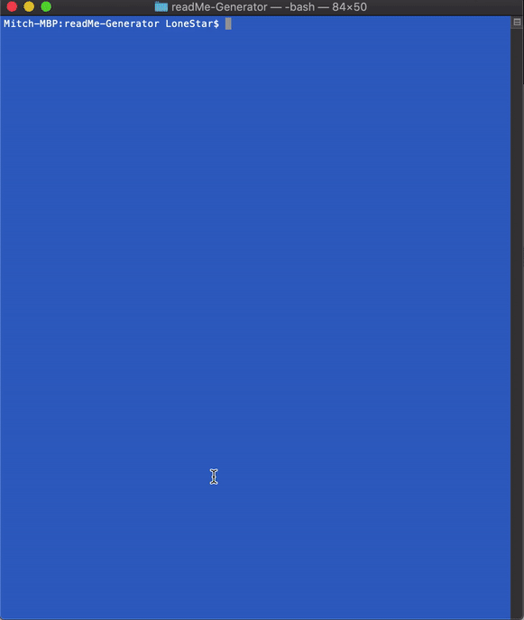

# Software specifications
* Title 
* Description
* Table of Contents
* Installation
* Usage
* License
* Contributing
* Tests
* Questions
  * User GitHub profile picture
  * User GitHub email
* At least one badge

## Minimum Requirements

* Functional, deployed application.

* The generated README includes 1 badge that's specific to the repository.



# usage
run using node
```sh
node index.js
```

## Submission on BCS

* A video demonstrating the entirety of the app's functionality 

  


